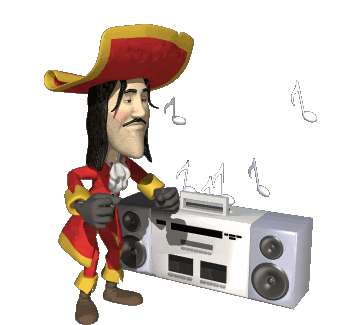

	

    <h1 align="center">holasoyender</h1>
    <h4 align="center">i dont even know how to write my name properly.</h4>

hello :wave: i'm ender, a spanish software engineer from madrid who doesn't know what capital letters are and hates everything related to c++. if you want to see some of the cool stuff I make keep reading :)))))

### languages i know, or at least i try to understand

### tools i use

### stats i guess

  
  

---

    
copyright © holasoyender 2019 - Now

